# Azure Hub-Spoke Secure Network Lab

## Overview

This project is an Azure networking and security lab built with Terraform.

It demonstrates a secure hub-spoke network architecture with private workload access, network security rules, Azure Bastion, and Azure Private Endpoint.

The goal of this project is to show real Azure cloud networking skills, not just basic resource creation.

## Architecture

The project uses a hub-spoke design:

- Hub VNet for shared access services
- Spoke VNet for workload resources
- VNet peering between hub and spoke
- Private VM inside the spoke network
- Azure Bastion for secure SSH access
- Storage Account accessed through Private Endpoint
- Private DNS Zone for private storage name resolution

## Resources Created

Terraform created:

- Resource Group
- Hub Virtual Network
- Hub Shared Subnet
- Spoke Virtual Network
- Spoke Workload Subnet
- VNet Peering
- Network Security Group
- Private Linux VM
- Azure Bastion
- Storage Account
- Private Endpoint
- Private DNS Zone
- Private DNS Zone VNet Link

## Network Design

Hub VNet:

`10.0.0.0/16`

Hub Shared Subnet:

`10.0.1.0/24`

Azure Bastion Subnet:

`10.0.2.0/26`

Spoke VNet:

`10.1.0.0/16`

Spoke Workload Subnet:

`10.1.1.0/24`

Private VM IP:

`10.1.1.4`

## Security Features

### Private VM

The Linux VM was deployed without a public IP address.

This prevents direct internet access to the VM.

### Network Security Group

The VM NSG allows SSH only from the hub network range:

`10.0.0.0/16`

All other inbound traffic is denied.

### Azure Bastion

Azure Bastion was used to connect to the private VM from the Azure Portal.

This allows secure SSH access without exposing port 22 to the internet.

### Private Endpoint

The Storage Account was configured with public network access disabled.

A Private Endpoint was created for Blob Storage so storage traffic can stay inside the private network.

### Private DNS Zone

A Private DNS Zone was created:

`privatelink.blob.core.windows.net`

This supports private DNS resolution for the storage private endpoint.

## Screenshots

### Hub VNet Overview

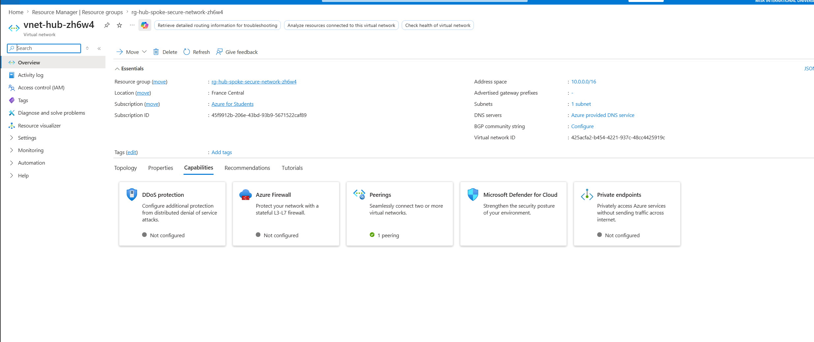

### Spoke VNet Overview

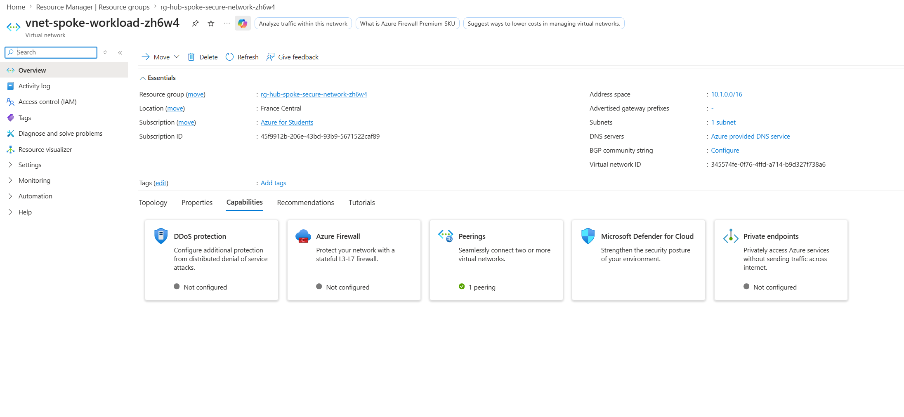

### VNet Peering

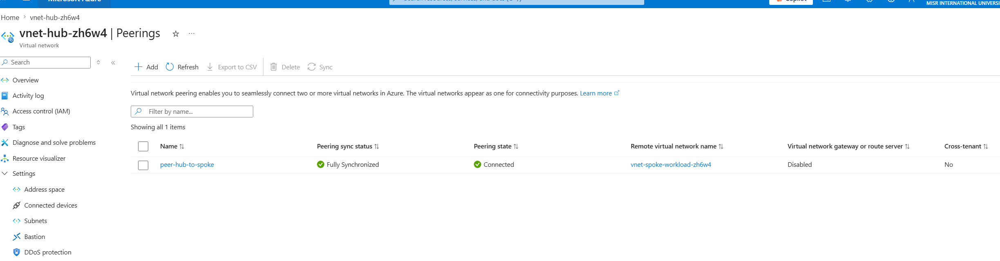

### Private VM Overview

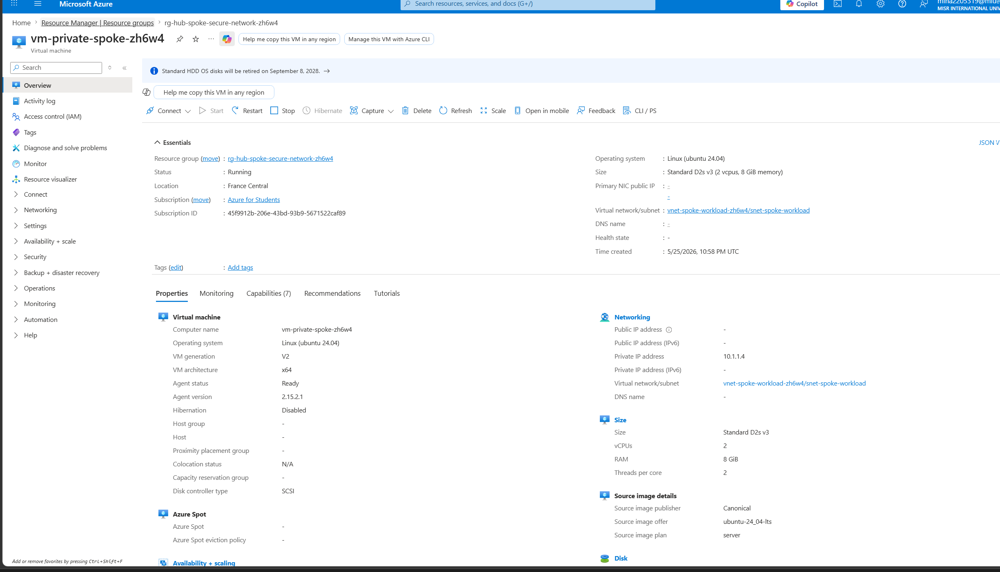

### NSG Rules

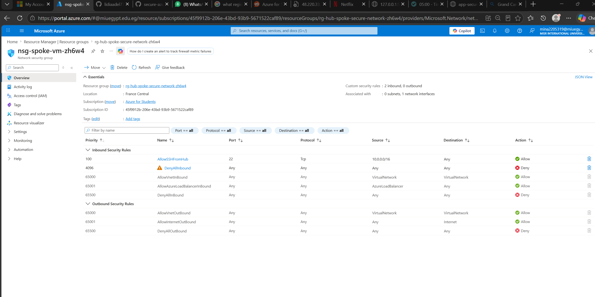

### Bastion Overview

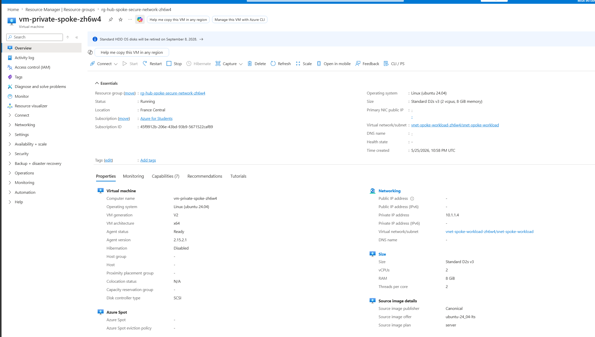

### Bastion VM Connect

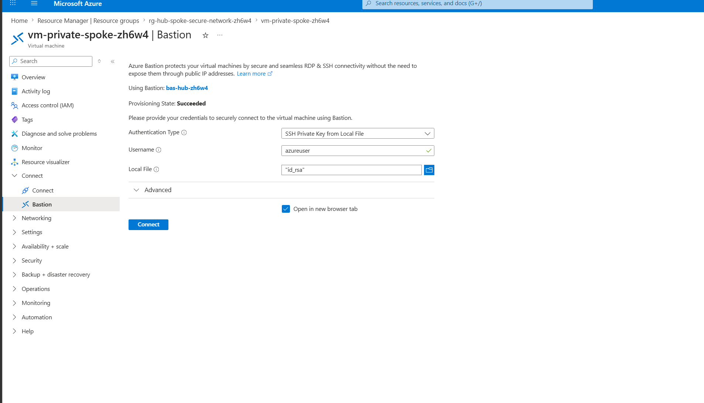

### Bastion SSH Session

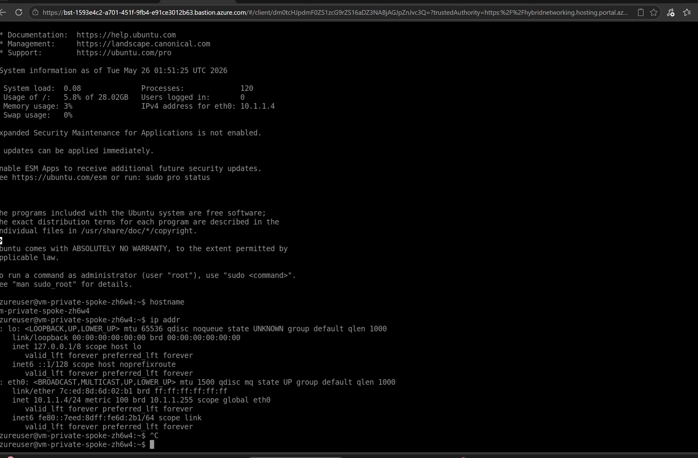

### Private Endpoint Overview

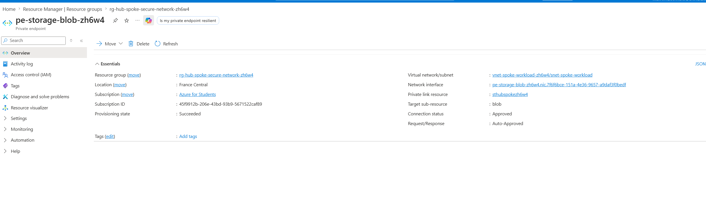

### Storage Networking Private Access

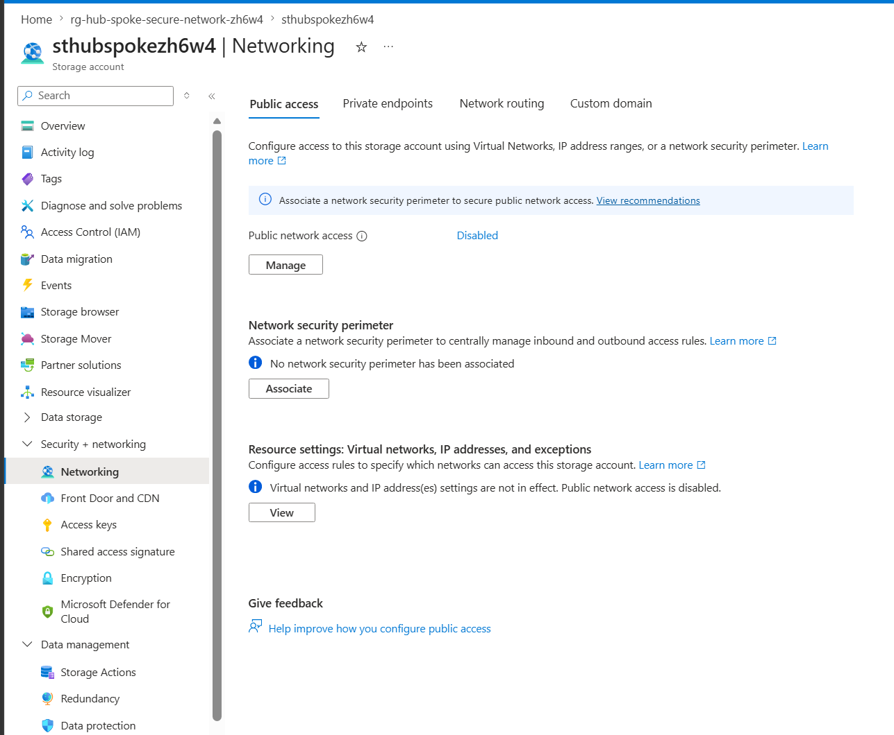

### Private DNS Zone

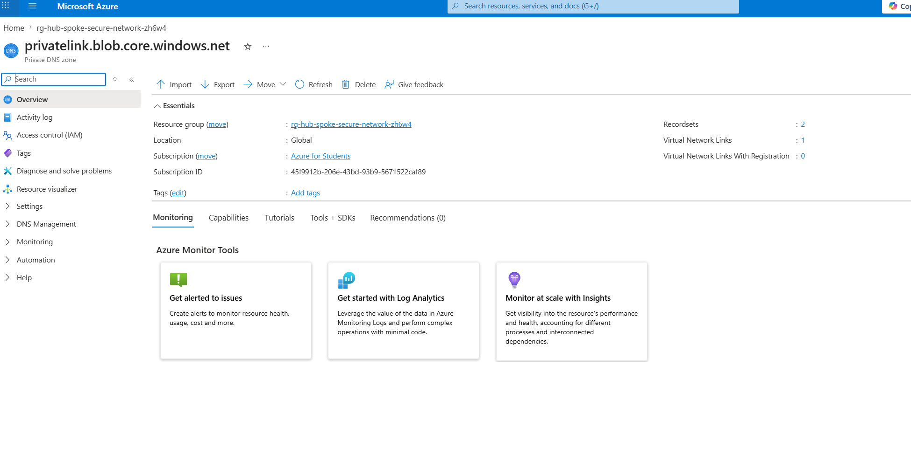

## Project Documentation

Detailed setup notes are available in:

`docs/setup-steps.md`

## Tools Used

- Microsoft Azure
- Terraform
- Azure CLI
- Azure Virtual Network
- Azure Bastion
- Azure Virtual Machine
- Azure Network Security Group
- Azure Storage Account
- Azure Private Endpoint
- Azure Private DNS Zone
- GitHub

## Key Learning Outcomes

This project demonstrates:

- Hub-spoke network architecture
- VNet peering
- Private VM deployment
- No-public-IP workload design
- NSG-based access control
- Secure VM access using Azure Bastion
- Private access to Azure Storage using Private Endpoint
- Private DNS integration
- Infrastructure as Code using Terraform
- Cost control by destroying resources after documentation

## Project Status

Completed.

Azure resources were destroyed after screenshots and documentation were captured to avoid unnecessary cost.
